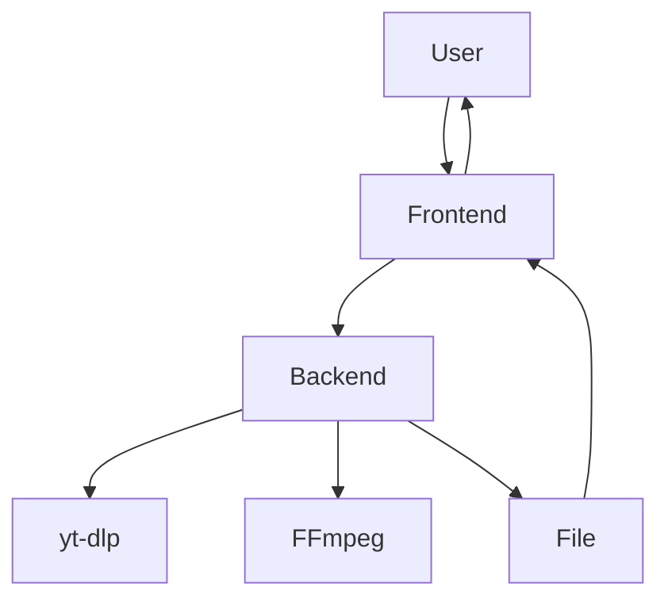

# Implementation Plan

## Architecture Overview
- **Frontend:** Static HTML/CSS/JS (Tailwind CSS)
- **Backend:** FastAPI (Python), yt-dlp, FFmpeg
- **API:** REST endpoints for download/convert

## Component Hierarchy
- App Shell (layout, theme)
- Link Input
- Format/Quality Selector
- Trim Controls
- Download Button
- Progress/Status
- Result/History

## API Endpoints
- `POST /download` — Accepts URL, format, quality, trim; returns download link
- `POST /cancel/{task_id}` — Cancels a running job
- `GET /status/{task_id}` — Polls job status

## Data Flow
1. User pastes link, selects options, clicks download
2. Frontend sends request to backend
3. Backend processes (yt-dlp/FFmpeg), returns file or error
4. Frontend shows progress, then download link

## Diagrams

## Testing
- Unit tests for backend endpoints
- Manual and automated browser tests
- Cross-browser/device QA

## Deployment
- Dockerized backend
- Static frontend deployable to CDN
- CI/CD pipeline for build/test/deploy